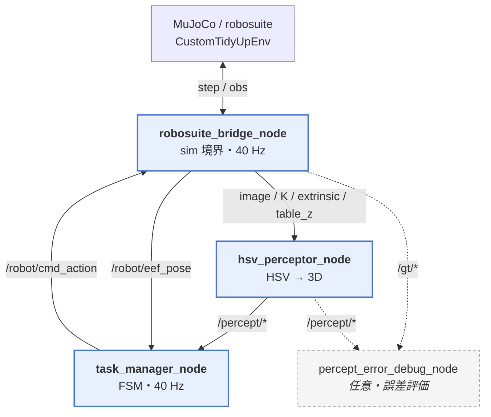

# Vision-based Pick & Place on ROS 2 + robosuite

**単眼カメラ画像だけ**を使い、机上の球 3 個を検出して箱へ片付ける pick & place を、ROS 2 の複数ノード構成で動かします。

```
画像 → HSV 検出 + 机平面との交差で 3D 化 → 状態機械で pick & place
```

シミュレータの真値（GT）は**制御には使いません**。知覚と制御の分離を、実機に近い形で示しています。

---

## Index

1. [デモ](#デモ)
2. [概要](#概要)
3. [設計上のポイント](#設計上のポイント)
4. [アーキテクチャ](#アーキテクチャ)
5. [処理の流れ](#処理の流れ)
6. [設定（`config/`）](#設定config)
7. [起動方法](#起動方法)
8. [技術スタック](#技術スタック)

---

## デモ

https://github.com/user-attachments/assets/3203123b-01db-4fe1-a728-46dfe3c75d12

---

## 概要

| 項目 | 内容 |
|---|---|
| タスク | 机上のオレンジ球 3 個を青い箱へ収納 |
| センサ | 単眼 RGB（agentview、深度なし） |
| ロボット | Panda + OSC_POSE（robosuite / MuJoCo） |
| ソフト構成 | ROS 2 Humble、ノード 3（+ 任意の誤差評価） |
| 制御入力 | 知覚推定 `/percept/*` のみ（GT はデバッグ専用） |
| パラメータ | `config/*.json` に集約（コード変更なしで調整可能） |

リポジトリ名に LIBERO が含まれますが、本デモは robosuite 上の自作 tidy-up 環境です。

---

## 設計上のポイント

1. **実機を想定したノード分割**  
   シミュレーション境界 / 知覚 / タスク制御を別プロセスにし、トピックで接続。シミュレータ内部の便利な真値に依存しない構成にしています。

2. **知覚と真値のトピック分離**  
   - 制御: `/percept/ball_poses`, `/percept/box_pose`  
   - 評価のみ: `/gt/*`  
   これにより「視覚で動かす」ことと「誤差を測る」ことを同時にできます。

3. **単眼 → 3D の前提を明示**  
   深度がないため、既知の机高さ平面とのレイ交差で (u, v) を 3D 化。球半径などの前提は `config/env.json` と共有し、ずれの影響を追いやすくしています。

4. **軸分離の状態機械**  
   XY 移動と Z 移動を混ぜず、把持・解放は並進ゼロ＋グリッパ指令のみ。オーバーシュートによる誤遷移を抑えるため、許容誤差内の連続到達でステップを進めます。

5. **設定の外部化**  
   シーン・HSV・制御ゲインを JSON に分離。再現実験やチューニングをコードと切り離しています。

---

## アーキテクチャ

データは基本的に一方向。ロボット指令だけが Bridge に戻ります。



### 主要ファイル

| ファイル | 役割 |
|---|---|
| `robosuite_bridge_node.py` | 唯一 robosuite に触れる境界。観測配信・アクション適用 |
| `hsv_perceptor_node.py` | 色検出と机平面交差による 3D 推定 |
| `task_manager_node.py` | pick & place の状態機械 |
| `percept_error_debug_node.py` | `/percept` と `/gt` の誤差（任意） |
| `config_loader.py` / `config/` | 環境・知覚・制御パラメータ |

### 主要トピック（制御経路）

| トピック | 方向 | 内容 |
|---|---|---|
| `/camera/image_raw` ほか | Bridge → HSV | 画像・内部・外部パラメータ・机高さ |
| `/percept/ball_poses`, `/percept/box_pose` | HSV → Task Manager | 推定位置 |
| `/robot/eef_pose` | Bridge → Task Manager | 手先位置 |
| `/robot/cmd_action` | Task Manager → Bridge | OSC 7 次元（並進 + グリッパ） |

真値 `/gt/*` と誤差 `/debug/*` は評価用で、制御ループには入りません。

---

## 処理の流れ

### 知覚

1. HSV で球（オレンジ）・箱（青）をマスク  
2. 輪郭の重心 (u, v) を取得  
3. カメラからレイを飛ばし、既知高さの水平面と交差させて 3D 化  
   - 球: `table_height + ball_radius`  
   - 箱: `table_height + box_center_offset_z`

### 制御（軸分離 FSM）

検出開始後、球位置と箱位置をラッチし、各球について次を繰り返します（移動高さは共通の `travel_z`）。

```
0  Z → travel_z
1  XY → 球の真上（高さ固定）
2  Z → 球中心
3  grasp（グリッパ閉・並進ゼロ）
4  Z → travel_z
5  XY → 箱の真上
6  release（グリッパ開・並進ゼロ）→ 次の球
```

OSC 指令は正規化 `[-1, 1]`。P ゲインと距離依存のクリップで指令を制限します。

---

## 設定（`config/`）

| ファイル | 対象 | 例 |
|---|---|---|
| `config/env.json` | シーン・sim | 机高さ、球位置/半径/摩擦、箱形状、カメラ、`control_freq=40`、`action_alpha` |
| `config/perception.json` | 知覚 | HSV 閾値、最小面積 |
| `config/control.json` | 制御 | `travel_z`、許容誤差、`kp`、保持ステップ |

`sim.control_freq` と `control_hz` は揃える想定です（既定 40 Hz）。

---

## 起動方法

ターミナル 3 つ（順番どおり）。

```bash
# 各ターミナルで環境を有効化してから
python robosuite_bridge_node.py      # A: シミュレーション
python hsv_perceptor_node.py         # B: 知覚（デバッグウィンドウあり）
python task_manager_node.py          # C: 制御
# 任意: python percept_error_debug_node.py
```

正常時、制御側に `Locked 3 balls + box; starting pick sequence` が出て動作開始します。

<details>
<summary><b>環境構築（macOS / Ubuntu）</b></summary>

### 前提

- macOS arm64（conda + [RoboStack](https://robostack.github.io/)）または Ubuntu 22.04（apt の ROS 2 Humble）
- 主な依存: `rclpy`, `cv_bridge`, `robosuite==1.4.1`, `mujoco==3.1.2`, OpenCV, NumPy

### macOS (Apple Silicon)

```bash
conda create -y -n ros2_libero --solver=libmamba --override-channels \
  -c conda-forge -c robostack-staging \
  python=3.11 "numpy=1.26" \
  ros-humble-ros-base ros-humble-cv-bridge \
  numba scipy pillow py-opencv glfw

conda activate ros2_libero
pip install "mujoco==3.1.2" pynput termcolor
pip install --no-deps "robosuite==1.4.1"
```

- `--solver=libmamba` / `--override-channels` は RoboStack 解決に必要です  
- `robosuite==1.4.1` 固定（1.5 系は API 非互換）  
- macOS では pip の `opencv-python` を入れない（`--no-deps`）こと

### Ubuntu 22.04

```bash
sudo apt install ros-humble-ros-base ros-humble-cv-bridge
pip install "mujoco==3.1.2" "robosuite==1.4.1" "numpy<2" opencv-python glfw pynput termcolor
source /opt/ros/humble/setup.bash
```

### 動作確認

```bash
python -c "import rclpy, cv_bridge, robosuite, mujoco, cv2, numpy; print('ok')"
```

</details>

<details>
<summary><b>トラブルシューティング（要約）</b></summary>

| 症状 | 確認すること |
|---|---|
| `No module named 'rclpy'` | conda / ROS 環境の有効化 |
| `load_controller_config` 欠落 | `robosuite==1.4.1` に戻す |
| 球が検出されない | Perception ウィンドウと `perception.json` の HSV / 面積 |
| 腕が動かない | 3 ノード起動、`/percept/ball_poses` の配信、`Locked 3 balls` ログ |
| 掴めない | `control.json` の `z_tol` / `grasp_hold_steps`、`env.json` の球半径 |

macOS では MuJoCo の GL をメインスレッド以外に移さないでください（`sim.mujoco_gl` は `glfw` / `cgl`）。

</details>

---

## 技術スタック

ROS 2 Humble · Python · robosuite 1.4.1 · MuJoCo 3.1.2 · OpenCV · NumPy
