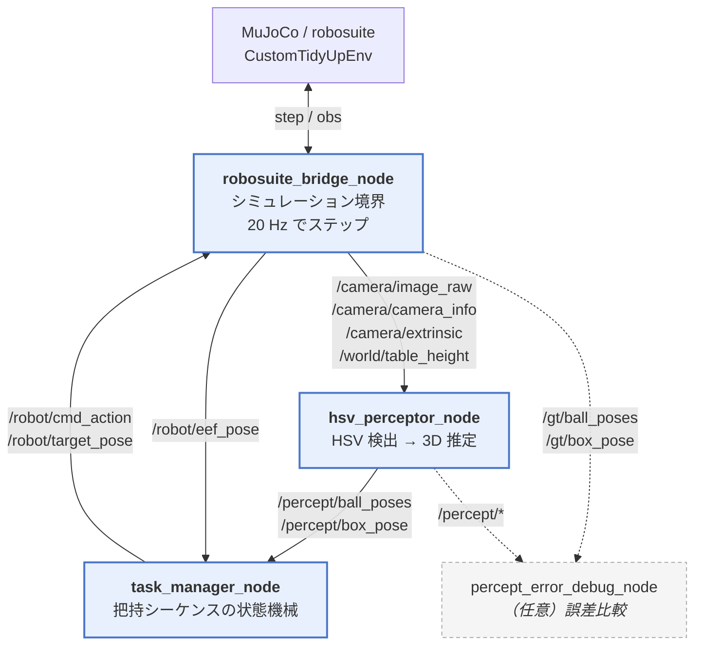

# robosuite-ros2 tidy-up

MuJoCo / robosuite のシミュレータ上で、**机の上の球 3 個をカメラ画像だけで見つけて、箱に片付ける**デモです。
知覚・制御・シミュレーションを ROS 2 の 3 ノードに分け、実機構成に近い形で動かせるようにしています。

```
  カメラ画像  ──▶  HSV 色検出 + 机平面との交差で 3D 化  ──▶  状態機械で pick & place
```

## 何のためのプロジェクトか

- **視覚ベースの pick & place を、実機と同じノード分割で試す。**
  シミュレータの真値（GT）を制御に使わず、カメラ画像から推定した位置だけでロボットを動かします。
- **知覚の誤差を定量的に見る。**
  推定値 `/percept/*` と真値 `/gt/*` を別トピックに分離してあるので、専用ノードで誤差を mm 単位で比較できます。
- **シーンやパラメータを Python を触らずに変える。**
  机の高さ・球の数と位置・箱の形・HSV 閾値・制御ゲインはすべて `config/` 以下の JSON にあります。

シーンは robosuite の `Lift` 環境を継承した自作環境 `CustomTidyUpEnv` です（元の cube は画面外に退避させ、球と箱を追加しています）。
**LIBERO 本体はこのデモの実行には不要です。**

---

## ノード構成

3 つのノードが 1 方向にデータを流します。ロボットへの指令だけが Bridge に戻ります。



> **制御経路に真値は一切入りません。** Task Manager が購読するのは `/percept/*` のみで、
> 真値は `/gt/*` に分離されています。そのため HSV 知覚とデバッグノードを同時に起動してもトピックが衝突しません。

### ファイル一覧

| ファイル | 役割 |
|---|---|
| [robosuite_bridge_node.py](robosuite_bridge_node.py) | メインのシミュレーション境界。シーン構築・センサ配信・アクション適用 |
| [hsv_perceptor_node.py](hsv_perceptor_node.py) | HSV 色検出 + 机平面との交差による 3D 位置推定 |
| [task_manager_node.py](task_manager_node.py) | 把持・収納の状態機械（20 Hz） |
| [percept_error_debug_node.py](percept_error_debug_node.py) | `/percept/*` と `/gt/*` の誤差比較（任意） |
| [config_loader.py](config_loader.py) | `config/*.json` の読み込み |
| [robosuite_bridge_lift_node.py](robosuite_bridge_lift_node.py) | 最小構成の Lift ブリッジ（レガシー／動作確認用） |

### トピック一覧

| トピック | 型 | 配信元 → 購読先 | 内容 |
|---|---|---|---|
| `/camera/image_raw` | `sensor_msgs/Image` | Bridge → HSV | agentview の BGR 画像（640×480、上下反転済み） |
| `/camera/camera_info` | `sensor_msgs/CameraInfo` | Bridge → HSV | 内部パラメータ K |
| `/camera/extrinsic` | `std_msgs/Float64MultiArray` | Bridge → HSV | 4×4 の `T_world_cam`（row-major 16 要素） |
| `/world/table_height` | `std_msgs/Float32` | Bridge → HSV | 机上面の z [m]。逆投影する平面の高さ |
| `/robot/eef_pose` | `geometry_msgs/Pose` | Bridge → Task Manager | 手先位置 |
| `/gt/ball_poses` | `geometry_msgs/PoseArray` | Bridge → Debug | 球の真値 |
| `/gt/box_pose` | `geometry_msgs/Pose` | Bridge → Debug | 箱底面の真値 |
| `/percept/ball_poses` | `geometry_msgs/PoseArray` | HSV → Task Manager | 球の推定位置（x 昇順） |
| `/percept/box_pose` | `geometry_msgs/Pose` | HSV → Task Manager | 箱の推定位置 |
| `/robot/cmd_action` | `std_msgs/Float32MultiArray` | Task Manager → Bridge | 7 次元 OSC 指令 `[dx, dy, dz, 0, 0, 0, gripper]`（gripper: −1 開 / +1 閉） |
| `/robot/target_pose` | `geometry_msgs/Pose` | Task Manager → Bridge | 現在の制御目標（ログ・可視化用） |
| `/debug/ball_error_stats` | `std_msgs/Float32MultiArray` | Debug | `[n, mean_xy, mean_3d, max_xy, max_3d]` [m] |
| `/debug/box_error_stats` | `std_msgs/Float32MultiArray` | Debug | `[ex, ey, ez, err_xy, err_3d]` [m] |

---

## 処理の流れ

### 1. 知覚（hsv_perceptor_node）

1. HSV 閾値で球（オレンジ）と箱（青）のマスクを作る
2. 輪郭を抽出し、面積が閾値以上のものの重心 (u, v) を取る
3. カメラ中心から (u, v) 方向にレイを飛ばし、**既知の高さの水平面と交差**させて 3D 座標を得る
   - 球 → `table_height + ball_radius` の平面
   - 箱 → `table_height + box_center_offset_z` の平面

単眼カメラで深度が取れないため、「対象が既知の高さにある」という前提で 3D 化しています。
そのため球の半径 (`env.json`) がずれると推定高さもずれます。

### 2. 制御（task_manager_node）

`INIT` で球 3 個と箱を検出したら位置を**ラッチ**し、以降は各球について 6 ステップを順に実行します。

```
INIT ──(球3個 + 箱を検出)──▶ EXECUTE_TASK ──(全球を配置)──▶ FINISHED

  各球のサブステップ:
    0 hover    球の真上 +15 cm へ移動
    1 descend  z のみ下降して球の中心高さへ
    2 grasp    グリッパを閉じて 30 ステップ保持
    3 lift     +22 cm 持ち上げ
    4 to box   箱の真上 (z = 1.05) へ XY 移動
    5 release  グリッパを開いて 20 ステップ保持 → 次の球へ
```

- 位置制御は P 制御（`kp = 2.5`）で、目標が遠いときは 0.15 m/s、近いときは 0.06 m/s に速度を制限します。
- ステップ遷移は「許容誤差内に **8 周期連続** で入ったら次へ」という条件で、オーバーシュートでの誤遷移を防いでいます。
- 球は INIT 時に x 昇順でソートし、左から順に処理します。

> **設計上の注意**：位置は INIT で一度ラッチするため、それ以降の球の移動には追従しません（オープンループ）。
> 逐次追従させたい場合は `balls_callback` の `state == "INIT"` ガードを外してください。

---

## 環境構築

### 前提

- macOS arm64 + Anaconda / Miniconda、または Ubuntu 22.04
- 依存: ROS 2 (`rclpy`, `cv_bridge`) / `robosuite` / `mujoco` / `opencv` / `numpy` / `glfw`

<details open>
<summary><b>macOS (Apple Silicon)</b></summary>

macOS には ROS 2 の公式バイナリがないため、conda-forge 経由の [RoboStack](https://robostack.github.io/) を使います。

**1. ROS 2 環境を作る**

```bash
conda create -y -n ros2_libero --solver=libmamba --override-channels \
  -c conda-forge -c robostack-staging \
  python=3.11 "numpy=1.26" \
  ros-humble-ros-base ros-humble-cv-bridge \
  numba scipy pillow py-opencv glfw
```

| オプション | 理由 |
|---|---|
| `--solver=libmamba` | **必須**。classic solver では ROS の依存が解けない |
| `--override-channels` | **必須**。`defaults` が混ざると RoboStack が壊れる |
| `python=3.11` | RoboStack osx-arm64 は 3.10 / 3.11 / 3.12 のみ |

**2. robosuite / mujoco を追加する**

```bash
conda activate ros2_libero
pip install "mujoco==3.1.2" pynput termcolor
pip install --no-deps "robosuite==1.4.1"
```

| 指定 | 理由 |
|---|---|
| `robosuite==1.4.1` | **固定必須**。1.5 系では `load_controller_config` が削除されている |
| `--no-deps` | **必須**。pip の `opencv-python` が入ると conda の `py-opencv` / `cv_bridge` と衝突してクラッシュしうる |

**3. 動作確認**

```bash
conda activate ros2_libero
python -c "import rclpy, cv_bridge, robosuite, mujoco, cv2, numpy; print('ok')"
ros2 topic list
```

`source /opt/ros/humble/setup.bash` は **不要**です。`conda activate` が ROS 2 の環境変数設定も兼ねます。

</details>

<details>
<summary><b>Ubuntu 22.04</b></summary>

ROS 2 Humble を apt で入れます（[公式手順](https://docs.ros.org/en/humble/Installation.html)）。

```bash
sudo apt install ros-humble-ros-base ros-humble-cv-bridge
pip install "mujoco==3.1.2" "robosuite==1.4.1" "numpy<2" opencv-python glfw pynput termcolor
```

```bash
source /opt/ros/humble/setup.bash
python robosuite_bridge_node.py
```

macOS と違い `cv_bridge` は system の libopencv とリンクしているため、pip の `opencv-python` をそのまま入れて問題ありません（`--no-deps` は不要）。

</details>

### 検証済みバージョン

| | macOS arm64 | Ubuntu 22.04 |
|---|---|---|
| ROS 2 Humble | RoboStack (conda) | apt `/opt/ros/humble` |
| python | 3.11 | 3.10 |
| rclpy | 3.3.16 | 3.3.21 |
| cv_bridge | 3.2.1 | 3.2.1 |
| robosuite | 1.4.1 | 1.4.1 |
| mujoco | 3.1.2 | 3.1.2 |
| opencv | 4.11.x | 4.11.x |
| numpy | 1.26.4 | 1.24〜1.26 |

---

## 起動

ターミナルを **3 枚**開き、それぞれで環境を有効化してから 1 ノードずつ起動します（順番はこの通りに）。

| # | 役割 | コマンド | 出る画面 |
|---|---|---|---|
| A | シミュレーション | `python robosuite_bridge_node.py` | MuJoCo Realtime Simulation |
| B | 知覚 | `python hsv_perceptor_node.py` | Perception Debug Window（検出点を重畳） |
| C | 制御 | `python task_manager_node.py` | ログのみ |

```bash
# 各ターミナルで共通
cd /path/to/libero-ros2
conda activate ros2_libero     # Ubuntu なら source /opt/ros/humble/setup.bash
```

任意で、知覚誤差を 1 Hz でログ出力する 4 枚目：

```bash
python percept_error_debug_node.py
```

正常なら Terminal C に `Locked 3 balls + box; starting pick sequence` が出て、腕が動き始めます。

### デバッグ用コマンド

```bash
ros2 topic list
ros2 topic hz /camera/image_raw       # 画像が来ているか
ros2 topic hz /percept/ball_poses     # 検出できているか
ros2 topic echo /robot/eef_pose       # 手先が動いているか
ros2 topic echo /debug/ball_error_stats
```

Bridge 自身も 1 秒ごとに `gripper=... | target=... | err_xyz=... mm` を出力します。

---

## 設定ファイル

数値は `config/` 以下の JSON に分離してあります（追加依存なし）。**レイアウトや閾値を変えるときに Python を編集する必要はありません。**

| ファイル | 主な項目 |
|---|---|
| [config/env.json](config/env.json) | `table.height` / `balls.radius`・`positions_xy`・`rgba` / `box.center`・`parts` / `camera` / `sim`（ロボット・コントローラ・制御周波数・`mujoco_gl`） |
| [config/perception.json](config/perception.json) | `hsv.ball_low/high`・`box_low/high`、`detection.*_min_area`、`box_center_offset_z` |
| [config/control.json](config/control.json) | `hover_clearance` / `lift_clearance` / `place_z` / 許容誤差 `*_tol` / `stable_need` / ゲイン `kp` / 速度上限 / 保持ステップ数 |

よくある変更：

- **球の数や位置を変える** → `env.json` の `balls.positions_xy` に要素を足し引き
  （Task Manager は `INIT` で **3 個以上** 検出されると開始するので、3 個未満にする場合は `task_manager_node.py` の条件も調整）
- **球の色を変える** → `env.json` の `balls.rgba` と `perception.json` の `hsv.ball_low/high` を**両方**
- **球の半径を変える** → `env.json` の `balls.radius` のみ（知覚ノードもここから読むので同期する）
- **把持が浅い / 深い** → `control.json` の `z_tol`、`tcp_offset_xy`

---

## 注意点

### レンダリング（macOS）

`config/env.json` の `sim.mujoco_gl`（既定 `glfw`）を bridge 起動時に環境変数へ適用します。
macOS のオフスクリーン描画は **glfw / cgl のみ**です。変更する場合もこの範囲に留め、
**シミュレーションループを別スレッドに移さないでください**（GLFW はメインスレッド専用）。

### LIBERO 本体との関係

本デモの実行に LIBERO 本体は不要です。LIBERO の学習・ベンチマークを別途行う場合は、
依存（numpy のピンなど）が RoboStack の `cv_bridge` と衝突しやすいので、**conda 環境を分けてください**。

| 環境例 | python | 用途 |
|---|---|---|
| `ros2_libero` | 3.11 | 本リポジトリの ROS 2 ノード |
| （任意）学習用環境 | — | LIBERO / torch など |

---

## トラブルシューティング

| 症状 | 原因と対処 |
|---|---|
| `ModuleNotFoundError: No module named 'rclpy'` | そのターミナルで `conda activate ros2_libero` していない |
| `AttributeError: ... load_controller_config` | robosuite 1.5 以降が入っている。`pip install --no-deps "robosuite==1.4.1"` で戻す |
| `conda create` が終わらない | `--solver=libmamba` を付けているか確認 |
| RoboStack の解決に失敗する | `--override-channels` の有無と、`~/.condarc` に `defaults` が残っていないかを確認 |
| 球が検出されない（`/percept/ball_poses` が空） | Terminal B の Perception Debug Window を見る。マスクに乗らないなら `perception.json` の HSV 閾値と `ball_min_area` を調整 |
| グリッパが動かない | 3 ノードすべてが起動しているか確認。`ros2 topic hz /percept/ball_poses` に出力があるか、Terminal C に `Locked 3 balls + box` が出ているか |
| 掴めずに弾いてしまう | `control.json` の `z_tol` を小さく、`grasp_hold_steps` を大きくする。`env.json` の `balls.radius` が実際とずれていないかも確認 |
| `FileNotFoundError: Config not found` | `config/` ディレクトリが `config_loader.py` と同じ階層にあるか確認（cwd は不問。パスはスクリプト位置から解決されます） |
